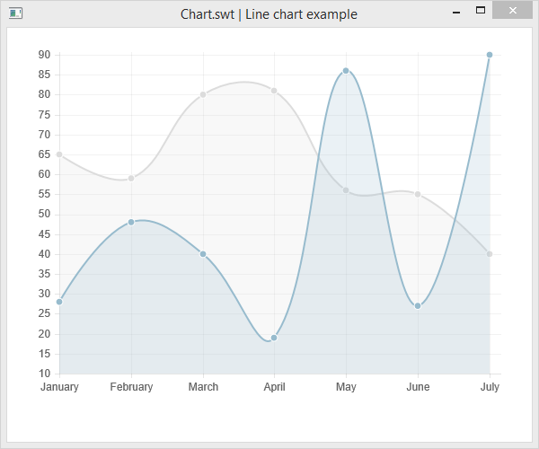

Chart.swt
=========
Chart.swt is a small wrapper library for using [Chart.js](http://www.chartjs.org/)
in [SWT](https://www.eclipse.org/swt/) applications (e.g. Eclipse RCP applications). 
It uses the SWT Browser widget to display a generated HTML file which contains the chart.
Therefore, a temporary HTML file is created containing the chart data which is
deleted when the browser widget is disposed. (Also the Chart.js library is 
stored locally so that no internet connection is required.) 

Nearly the same configuration options as in Chart.js can be used when creating 
the chart via the Java API and also the data model is very similar. Using the 
chart component looks like this: 
 
```java
Browser browser = new Browser(shell, SWT.NONE);
BarConfig config = new BarConfig();
config.width = 525;
config.height = 400;
new Chart(browser).bar(createData(), config);
```

See also the examples for the different chart types:

* [Bar chart](src/test/java/chart/BarChartExample.java)
* [Doughnut chart](src/test/java/chart/DoughnutChartExample.java)
* [Line chart](src/test/java/chart/LineChartExample.java)
* [Pie chart](src/test/java/chart/PieChartExample.java)
* [Polar area chart](src/test/java/chart/PolarAreaChartExample.java)
* [Radar chart](src/test/java/chart/RadarChartExample.java)



## Installation with Maven

	git clone https://github.com/GreenDelta/Chart.swt.git
	cd Chart.swt
	mvn install
	
	# test an example
	mvn exec:java -Dexec.mainClass=chart.LineChartExample -Dexec.classpathScope=test
